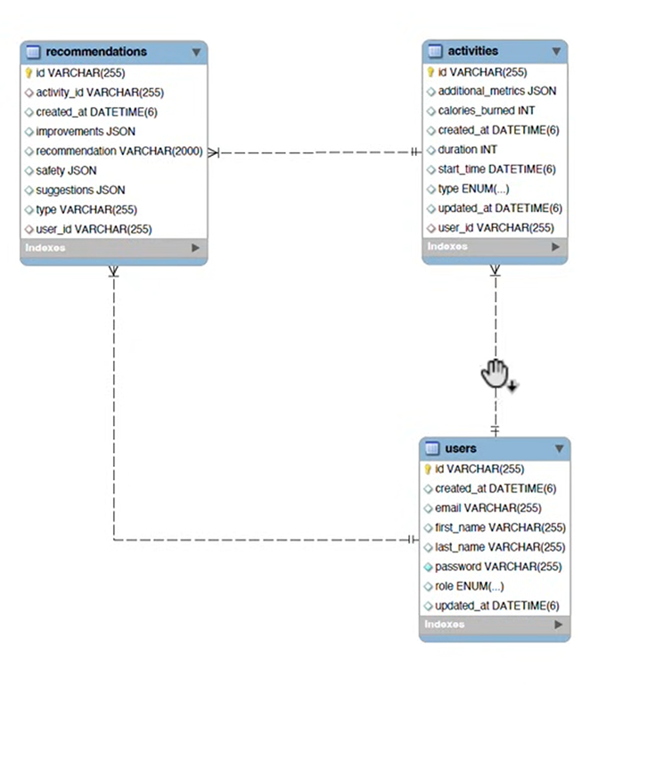

# 🏋️‍♂️ Fitness Tracker Application – Spring Boot

🚀 A real-world Spring Boot backend project built end-to-end to master backend development.
 built end-to-end to master backend development, security, and deployment.

---

## 🔥 What I Built

A complete **Fitness Tracker REST API** with the following features:

- 👤 User authentication & authorization  
- 🏃 Activity tracking  
- 🤖 Personalized fitness recommendations  
- 🔐 Secure, role-based APIs  
- ☁️ Dockerized & cloud-deployed application  

---

## 🧠 Core Concepts I Learned

### ⚙️ Backend & Architecture

- 🌱 Spring Boot fundamentals & clean project setup  
- 🗄️ Database design using **JPA & Hibernate**  
- 🔄 **DTO Pattern**  
- 🧱 **Builder Pattern**  
- ✨ **Lombok** for clean & readable code  

---

### 🔐 Security (Major Focus)

- 🔑 Spring Security (from basics → advanced)  
- 🪪 **JWT Authentication & Authorization**  
- 🧩 **Role-Based Access Control (RBAC)**  
- 🔒 Password encryption using **BCrypt**  
- 🧪 Method-level & API-level security  

---

### 📡 REST & API Design

- 🌐 RESTful API design with best practices  
- 📝 Input validation using **Bean Validation**  
- 📖 **Swagger / OpenAPI** documentation  

---

### 🐳 DevOps & Deployment

- 🐳 Dockerizing the Spring Boot application  
- ☁️ Free cloud deployment  
- 🛢️ **MySQL** database integration  

---

## 🏁 Final Outcome

- ✅ Production-ready Spring Boot REST API  
- ✅ Strong understanding of Security, JWT & RBAC  
- ✅ Hands-on experience with Docker & deployment  
- ✅ Confidence to build real-world backend systems  

---

## 🎓 Reference

- 📺 **Course:** Spring Boot Fitness Tracker Application  
- 👨‍🏫 **Instructor:** Faisal  
- 🔗 **YouTube:** https://www.youtube.com/watch?v=NViOWCfROQk  

---

💡 This project represents my hands-on journey from **Spring Boot basics** to **production-grade backend development**.

